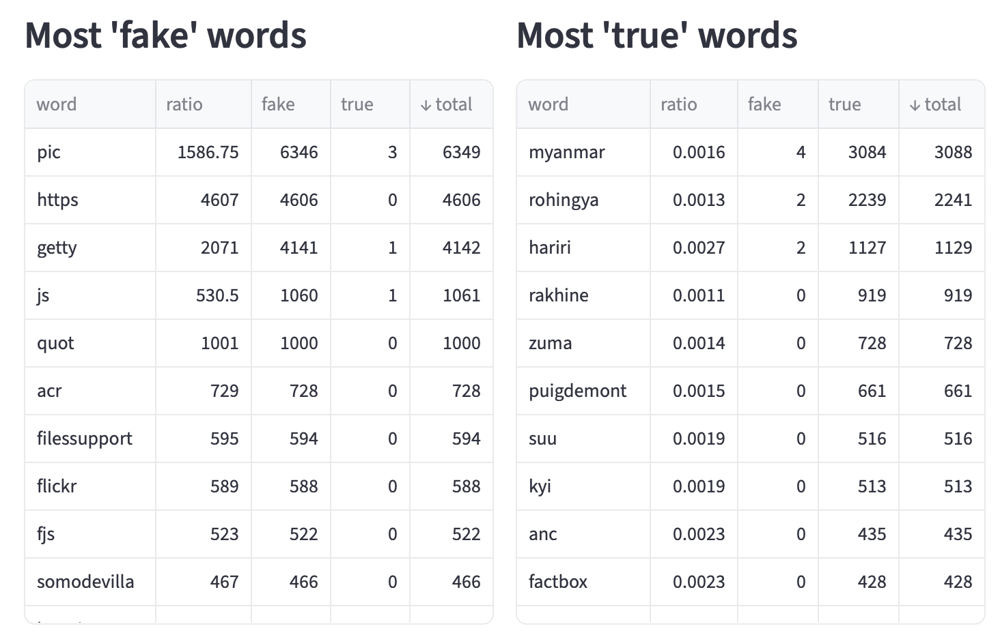
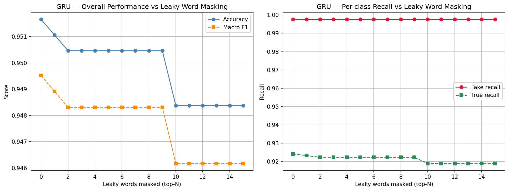

# Fake News Detection with Recurrent Neural Networks
**Final project for the Postgraduate course: Artificial Intelligence with Deep Learning (UPC School, 2026)**

| | |
|---|---|
| **Team members** | Valentina Martínez · Selena Rodríguez · Marc Humet |
| **Advisor** | Pol Caselles |
| **Dataset ISOT** | [ISOT Fake News Dataset](https://www.uvic.ca/ecs/ece/isot/datasets/fake-news/index.php) (~44K news articles) |
| **Dataset LIAR** | [LIAR Dataset](https://www.kaggle.com/datasets/doanquanvietnamca/liar-dataset) (~42K news articles) |
| **Task** | Binary classification: Fake (0) vs True (1) |

## Table of Contents

- [How to Run](#how-to-run)
- [Final Report](#final-report)
  - [1. Introduction](#1-introduction)
  - [2. Dataset: ISOT Fake News Dataset](#2-dataset-isot-fake-news-dataset)
  - [3. Deep Neural Networks Models](#3-deep-neural-networks-models)
  - [4. Experiments](#4-experiments)
    - [4.1 Cleaning the ISOT Dataset](#41-cleaning-the-isot-dataset)
    - [4.2 Excluding Exclusive Words from Fake and Real News](#42-excluding-exclusive-words-from-fake-and-real-news)
    - [4.3 Vocabulary Dimensionality Analysis (75k vs. 2k Tokens)](#43-vocabulary-dimensionality-analysis-75k-vs-2k-tokens)
    - [4.4 GRU training with different datasets](#44-gru-training-with-different-datasets)
    - [4.5 Comparing the different Models with ISOT & LIAR dataset](#45-comparing-the-different-models-with-isot--liar-dataset)
  - [5. Next Steps](#5-next-steps)
  - [6. Bibliography](#6-bibliography)

## How to Run

### Prerequisites

- Google account (for Colab + Drive)
- Copy the folder `aidl-final-project` in the root of your Google drive

### 1. Preprocessing

Open `ISOT_Preprocessing.ipynb` in Google Colab. It will:
- Request access to google drive. You should grant it in order to see the Datasets and write the results there
- Remove duplicates, split into train/val/test
- Clean and tokenize train/val (test left uncleaned)
- Build vocabulary, convert to padded ID tensors
- Save artifacts to `Google Drive/aidl-final-project/artifacts/`

### 2. Training

Open `ISOT_Training.ipynb` in Google Colab:
1. Set `MODEL_TYPE` in the Configuration cell (`"RNN"`, `"GRU"`, or `"LSTM"`)
2. Adjust hyperparameters as needed
3. Run all cells

Results are saved to `Google Drive/aidl-final-project/outputs/{model_type}/`.

---

## Final Report

## 1. Introduction

The primary goal of this project is to develop and evaluate a supervised machine learning model capable of autonomously classifying news articles as either True or Fake. By leveraging Natural Language Processing (NLP) techniques, we aim to identify linguistic patterns and statistical regularities that distinguish factual reporting from misinformation.

### 1.2 Motivation

The motivation for this research is driven by the urgent need to preserve information integrity in an era where the rapid dissemination of misinformation poses a direct threat to public opinion and social stability. Given the overwhelming volume of data generated daily, manual fact-checking has become insufficient, making automated and scalable solutions essential. By leveraging Artificial Intelligence, this project aims to transcend human cognitive biases through advanced pattern recognition. Unlike traditional human analysis, AI can identify linguistic structures and statistical regularities characteristic of deceptive content, providing a robust, data-driven defense against digital disinformation.

### 1.3 Proposal

This project utilizes three different many-to-one recurrent architectures—RNN, LSTM, and GRU—to classify news articles from the public ISOT dataset. The main objectives are:

* Test an end-to-end pipeline for the GRU architecture, encompassing preprocessing, embedding, model training, and testing.
* Analyze the textual features (such as vocabulary, style, and structure) that the models leverage to distinguish between fake and real news.
* Compare the performance of the RNN, LSTM, and GRU models using standard metrics: precision, recall, and F1-score

## 2. Dataset: ISOT Fake News Dataset

The **ISOT Fake News Dataset** is a benchmark dataset for binary text classification. It comprises over 44,000 news articles compiled between 2016 and 2017. The data is divided into two primary categories:

* **Real News (True Class):** Articles sourced from *Reuters.com*, ensuring a standard of neutrality and veracity.
* **Fake News (Fake Class):** Articles from websites flagged as unreliable by fact-checking organizations such as PolitiFact and Wikipedia.

The distribution of the classes is as follows:

| Class | Amount of articles | Percentage |
| :---: | :---: | :---: |
| True  | 21,417 | 47.7% |
| Fake  | 23,481 | 52.3% |
| **Total** | **44,898** | **100%** |

For this project, the data was shuffled and split into training, validation, and test sets. A standard 70/20/10 split was applied to ensure the model can be evaluated on unseen data while maintaining enough samples for a robust training phase.

### 2.1 Dataset Interpretation

Exploratory Data Analysis (EDA) revealed significant structural and lexical differences between the two classes:

* **Article Length:** Real news follows a bimodal distribution, containing both short reports and long-form articles. In contrast, fake news tends to follow a unimodal distribution with more uniform lengths (Figure 1).
* **Data Leakage:** Label-exclusive terms, such as the "Reuters" (The news agency), presented a critical risk of data leakage. Targeted cleaning was required to ensure the model detects linguistic patterns rather than source-specific watermarks. To prevent artificial shortcuts, the 'subject' column was excluded, focusing exclusively on 'title' and 'text' (Figure 2).
* **Lexical Richness:** The dataset's vocabulary follows *Zipf's Law*, characterized by a few high-frequency terms and a long tail of rare words (Figure 3). A significant portion of the corpus consists of *hapax legomena* (words appearing only once) which typically represent typographical errors or highly specific words that do not aid generalization. Filtering these rare terms is essential to reduce the complexity of the feature space and prevent the model from learning from noise. Preliminary analysis of the top 5,000 words reveals a rapid frequency decay, confirming that focusing on the most frequent linguistic patterns is necessary for robust predictive performance.

*Figure 1: Article Length Distribution by Label*

*Figure 2: Global Vocabulary Frequency Distribution*

*Figure 3: News distribution per Subject and Class*

### 2.2 Dataset transformations (Preprocessing)

To transform the raw news articles into a format compatible with neural networks, a specialized preprocessing pipeline was developed in Python. This process ensures the model learns semantic relationships rather than noise or metadata signatures.

* **Data Deduplication and Splitting:** The dataset was first filtered to remove duplicate entries based on the article body to prevent evaluation bias. The dataset was divided using a two-stage stratified split. Initially, 10% of the data was isolated for the final Test set. The remaining 90% was partitioned again to create a Validation set (~20%) and a Training set (~70%). This ensures that the model is tuned and evaluated on entirely independent data subsets while maintaining class balance.
* **Text cleaning and normalization:** A "light cleaning" strategy was applied to preserve the narrative structure while removing noise. This included:
  * Removing HTML tags, URLs, emails, and social media domains (e.g., *pic.twitter*).
  * Eliminating non-printable characters and normalizing whitespaces.
  * Removing specific metadata patterns such as media credits (e.g., *getty*), "via" tags, and artifacts like "2017trump".
  * Filtering out words shorter than 3 characters to eliminate typos or unnecessary noise.
* **Stopword removal and Lemmatization:** To reduce the feature space, common English stopwords with low semantic value were removed. Furthermore, WordNet Lemmatization was applied to group different inflected forms of a word (e.g., "running" to "run"), allowing the model to recognize them as a single concept.
* **Tokenization and vocabulary construction:** The text was converted into sequences of tokens represented by full words. A vocabulary was built using a minimum frequency threshold (min_freq=2) and a maximum limit of 2,000 tokens. Unknown words were mapped to a specific `<unk>` token.
* **Padding and Truncation:** To facilitate batch processing in the neural network, all sequences were standardized to a fixed length of 512 tokens. Shorter articles were padded with a `<pad>` token, while longer ones were truncated, ensuring a consistent input shape for the model.

## 3. Deep Neural Networks Models

In this section, we present the recurrent architectures implemented for the fake news detection task. We focus on models designed to handle sequential data, allowing the network to capture the temporal dependencies and context within news articles.

### 3.1. Evaluation Metrics

To assess the performance of our classifiers, we use four standard metrics derived from the *Confusion Matrix:*

* **Accuracy:** Measures the total proportion of correct predictions. While useful, it can be misleading if classes are imbalanced. Ranges from 0 to 1, being 1 the best value.
* **Precision:** Focuses on the "False Positive" rate. This metric tests the ability of the classifier not to label a real news article as fake. It answers: *Of all articles flagged as fake, how many were actually fake?* Ranges from 0 to 1, being 1 the best value.
* **Recall (Sensitivity):** Focuses on the "False Negative" rate. This metric tests the ability of the classifier to find all the fake news articles. It answers: *Of all the actual fake news in the dataset, how many did the model catch?* Ranges from 0 to 1, being 1 the best value.
* **F1-Score:** Combines Precision and Recall into a single number. It is the most robust metric for evaluating a model's overall performance in this project. Ranges from 0 to 1, being 1 the best value.

In our case, since the ISOT dataset is balanced (~50/50), accuracy serves as a reliable indicator of overall performance. However, precision and recall remain essential to evaluate the model's specific behavior regarding False Positives (labeling truth as fake) and False Negatives (missing fake news), ensuring a comprehensive assessment of its reliability.

### 3.2. Recurrent Architectures

Since the dataset is small and text size is similar as a Twitter post, the idea is to start with more simple architecture and analyze the behavior of the data with the following architectures:

1. Recurrent Neural Networks (RNN)
2. Long Short-Term Memory (LSTM)
3. Gated Recurrent Unit (GRU)

And the criterion used is BCE Loss with Sigmoid Layer and the optimizer is Adam Algorithm.

### 3.3 Training

The first model we tried, GRU, had **good training** results from the very beginning with the first few hyperparameters we tried:

* Embedding dimensions: 32 / 64 / 128
* Hidden size: 32 / 64 / 128
* Batch size: 32
* LR: 0.001
* GRU Layers: 1
* Bidirectional
* Epoch numbers: 10

Because of that, we didn't have to fine tune the initial hyperparameters and we didn't consider using word2vec or Glove to transfer learning for those models. The random initialization of embeddings and normal backpropagation was good enough.

Preprocessing and training were all in the same Google colab notebook. At some point in the project we decided to split it in two. So training and preprocessing could evolve independently, using some files in the artifacts folder to pass information between the two.

We introduced RNN and LSTM and we still had some good results, so we decided that a transformer was not needed and an overkill for the task. At least while we were not sure about our dataset was the problem.

Because the model worked so well, we focused again on the dataset preprocessing part and started the research to look for something that was potentially biasing the model.

## 4. Experiments

This section presents the experiments conducted to better understand why the model achieved very high performance on the ISOT dataset. The main goal was not only to optimize the classifier, but also to investigate whether the results were influenced by dataset-specific artifacts, lexical shortcuts, or duplicated samples. Several experiments were therefore designed to test the robustness of the GRU model under different preprocessing settings, model architectures, and datasets.

### 4.1 Cleaning the ISOT Dataset

**Hypothesis**

The dataset may contain elements that make the classification task artificially easy, allowing the model to achieve unusually high performance.

**Experiment Setup**

Additional cleaning steps were applied to the dataset:

* Very infrequent words were filtered out;
* 11k duplicate samples were identified and removed.
* Lemmatization and delete the stop words in the dataset.
* Test the new input with the GRU Model with the following hyperparameter used:
  * Embedding dimension: 32
  * Hidden Size: 128

**Results**

* The duplicate analysis showed that approximately **25% of the dataset consisted of duplicate entries**.
* The overall dataset vocabulary was reduced by around 50% (Original size ~96,654 and it was reduced to ~46,864).
* As you can see in the frequency histogram of the words, there's a propensity of a lot of words that appear only one or a few times.
* The result of loss, accuracy in the training and the metrics in the test, only vary in a small portion (0.01 ~ 0.001) as you can see in the image of the trainings below.

*Figure 4: Frequency of the word appearance distribution*

*Figure 5: GRU training of ISOT before and after clean*

**Conclusion**:
Cleaning the dataset reduced the vocabulary size and made the corpus more consistent. This preprocessing step also made training the GRU model more efficient. The hypothesis was not true, because the GRU model had very similar results.

### 4.2 Excluding Exclusive Words from Fake and Real News

**Hypothesis**

The model may be relying on words that are highly specific to one class rather than learning generalizable patterns of misinformation detection.

Topic-specific words that appear almost exclusively in true articles — such as *myanmar, rohingya, hariri*— could act as spurious shortcuts. If the model relies on them, masking these words at test time should cause a measurable drop in performance.

**Experiment Setup**

Rather than retraining the model with different word lists (which introduces variance from random initialization), we:

1. Train the model once
2. Evaluate the frozen model on the test set with the top-N true leaky words replaced by \<pad\>, for N in 0-15

The leaky words are sourced from words with the highest true/fake ratio (e.g., myanmar appears in 3,084 true articles but only 4 fake ones).

**Results**

The analysis revealed that:

* We see a drop in accuracy as we remove more and more words
* The accuracy/Macro F1 drop between 0 and 15 words remove is around -5% over a very **good overall** accuracy and recall when we don't remove any word (the 0 mark in the x axis)

*Figure 6: Graphics of the overall performance vs leaky word masking with GRU*

**Conclusion**

Even after cleaning the data, the GRU model continued to be robust to leaky word removal. This suggests that, although some obvious lexical shortcuts were identified, the dataset may still contain residual class-specific artifacts that make the task easier than real-world fake news detection.

So it was decided to try a new dataset.

### 4.3 Vocabulary Dimensionality Analysis (75k vs. 2k Tokens)

**Hypothesis**

Reducing the vocabulary size to 2,000 tokens will significantly improve the model's classification performance compared to a larger vocabulary (75,000) by eliminating statistical noise and preventing the model from overfitting on infrequent terms.

**Experiment Setup**

We compared the performance of our GRU model using two different vocabulary sizes (2,000 and 75,000 tokens). All other hyperparameters and data splits remained constant.

**Results**

The quantitative analysis shows a definitive performance gap. The 2,000-token model achieved near-perfect classification, with an Accuracy of 98.8% and an F1-Score of 99.1%. In contrast, the 75,000-token model suffered a significant degradation, dropping to 79.6% Accuracy.

Performance Metrics Comparison

| Vocabulary Size | Accuracy | Precision | Recall | F1-Score |
| :---- | :---- | :---- | :---- | :---- |
| 2,000 tokens | 98.8% | 98.4% | 99.8% | 99.1% |
| 75,000 tokens | **79.6%** | 99.2% | 68.0% | 80.7% |

*Figure: Confusion matrix comparison between a the vocabulary size of 2000 (left) and 75000 (right)*

<table>
<tr>
<td></td>
<td></td>
</tr>
</table>

**Conclusion**

This experiment confirms that for the ISOT dataset, less is more. The vast majority of the 75,000 tokens in the larger vocabulary acted as noise, leading to overfitting and poor generalization. Reducing the vocabulary to the top 2,000 words not only makes the model lighter and faster but also drastically improves its accuracy by focusing on the core semantic differences between real and fake news.

### 4.4 GRU training with different datasets

**Hypothesis**

The almost perfect scores obtained on ISOT may be due to the model learning dataset-specific patterns. If this is the case, then performance should decrease when the same GRU model is trained on a different dataset or on a more diverse combined dataset.

**Experiment Setup**

To test this hypothesis, the same GRU architecture and training configuration were applied to different datasets. In addition to ISOT, the **LIAR dataset** was incorporated based on recommendations from previous literature. The experiments considered three training conditions:

* **ISOT** only,
* **LIAR** only,
* **BOTH**, a combined dataset including ISOT and LIAR.

The GRU model was trained using the following hyperparameters:

* embedding dimension: **128**
* number of epochs: **3**
* hidden size: **64**

The LIAR dataset was simplified into two categories, **real** and **fake**, resulting in **12,791 samples**:

* Real: **7,134** samples (**55.8%**)
* Fake: **5,657** samples (**45.2%**)

And was filtered through a simple cleaning with lowercase, lemmatization and delete stopwords.

**Results**

The ISOT-based model achieved extremely high results, with near-perfect precision, recall, and F1-scores on the test set. Although these metrics are strong, they should be interpreted with caution. In a task as complex as fake news detection, performance that is almost perfect is unusual.

By contrast, the LIAR dataset produced much lower scores, suggesting that it is a more difficult and more realistic benchmark. Its shorter statements, higher variability, and less regular structure make it harder for the model to rely on superficial cues. The combined dataset produced intermediate results, which further supports the idea that greater diversity reduces artificial performance gains.

In the following graphic you will see the loss and accuracy using the three dataset:

*Figure 7: GRU training graphic with LIAR, ISOT and BOTH dataset*

The test results obtained with the trained GRU model were as follows:

| Dataset | Class | Precision | Recall | f1-Score |
| :---- | :---- | ----- | ----- | ----- |
| ISOT | True | 0.98 | 1.00 | 0.99 |
|  | Fake | 0.99 | 0.96 | 0.98 |
| LIAR | True | 0.63 | 0.43 | 0.51 |
|  | Fake | 0.48 | 0.67 | 0.56 |
| BOTH | True | 0.92 | 0.74 | 0.82 |
|  | Fake | 0.69 | 0.90 | 0.78 |

**Conclusion**

These experiments show that model performance depends heavily on the dataset used. The results suggest that the strong performance observed on ISOT is influenced not only by the architecture itself, but also by the specific properties of that dataset.

### 4.5 Comparing the different Models with ISOT & LIAR dataset

**Hypothesis**:
GRU is expected to perform strongly because of its bidirectional structure and efficient handling of sequential text data; it may not consistently outperform LSTM and RNN across all datasets. Therefore, this experiment aims to compare the three architectures and identify which model generalizes better under different data conditions.

**Experiments Setup**

To evaluate the impact of model architecture, three recurrent neural network variants were tested: **RNN, LSTM, and GRU**. Each model was trained and evaluated on three dataset configurations:

* **ISOT only**
* **LIAR only**
* **BOTH**, a combined dataset including ISOT and LIAR

All models were trained under the same experimental conditions to ensure a fair comparison. The hyperparameters used were:

* embedding dimension: 128
* hidden size: 64

**Results**

ISOT Dataset Performance Comparison

On the **ISOT dataset**, all three models achieved strong performance, but **LSTM obtained the best overall results**, with the highest precision, recall, and F1-scores across both classes. This suggests that ISOT is a relatively easy dataset for recurrent architectures and may contain patterns that are easy to learn.

| Model | Fake Precision | True Precision | Fake Recall | True Recall | Fake F1 | True F1 |
| :---- | ----- | ----- | ----- | ----- | ----- | ----- |
| RNN | 0.98 | 0.93 | 0.87 | 0.99 | 0.92 | 0.96 |
| GRU | 0.96 | 0.91 | 0.84 | 0.98 | 0.90 | 0.95 |
| LSTM | 0.99 | 0.95 | 0.91 | 1.00 | 0.95 | 0.97 |

*Figure 8: ISOT dataset training with RNN, LSTM and GRU models*

BOTH Dataset Performance Comparison

On the **combined dataset (BOTH)**, performance decreased compared with ISOT, indicating that the inclusion of LIAR increases task difficulty and dataset diversity. In this setting, **GRU produced the most balanced results**, achieving stronger overall performance than RNN and more consistent class-level behavior than LSTM.

| Model | Fake Precision | True Precision | Fake Recall | True Recall | Fake F1 | True F1 |
| :---- | ----- | ----- | ----- | ----- | ----- | ----- |
| RNN | 0.77 | 0.76 | 0.56 | 0.89 | 0.65 | 0.82 |
| GRU | 0.78 | 0.85 | 0.77 | 0.86 | 0.78 | 0.86 |
| LSTM | 0.70 | 0.91 | 0.89 | 0.75 | 0.78 | 0.82 |

*Figure 9: BOTH dataset training with RNN, LSTM and GRU models*

LIAR Dataset Performance Comparison

On the **LIAR dataset**, all models performed considerably worse than on ISOT. This confirms that LIAR is a more challenging and realistic benchmark. The differences between models were smaller, and no architecture clearly dominated in all metrics. However, **GRU and LSTM showed slightly stronger results than RNN**, depending on the class and metric considered.

| Model | Fake Precision | True Precision | Fake Recall | True Recall | Fake F1 | True F1 |
| :---: | :---: | :---: | :---: | :---: | :---: | :---: |
| RNN | 0.47 | 0.61 | 0.67 | 0.41 | 0.55 | 0.49 |
| GRU | 0.50 | 0.63 | 0.58 | 0.56 | 0.54 | 0.59 |
| LSTM | 0.51 | 0.60 | 0.43 | 0.67 | 0.46 | 0.64 |

*Figure 10: LIAR dataset training with RNN, LSTM and GRU models*

**Conclusion**

These experiments confirm that **dataset characteristics have a greater impact on performance than model choice alone**. While recurrent architectures perform very well on ISOT, their results drop significantly on LIAR and remain intermediate on the combined dataset. This suggests that the near-perfect performance observed on ISOT is likely influenced by dataset-specific patterns rather than true robustness in fake news detection.

Therefore, the hypothesis that **GRU is the best overall model is only partially supported**. GRU performs well, especially on the combined dataset, but **LSTM achieves the best results on ISOT**, and no single model is consistently superior across all datasets. At this stage, improving **data quality, diversity, and balance** appears to be more important than moving to a more sophisticated architecture.

## 5. Next Steps

* Include more samples of other dataset to balance the amount of ISOT samples to evaluate the performance of the model based on the hyperparameters or the model architecture.
* Tune the different models using the dataset gathered in the step before to evaluate the performance.
* If new samples make the model underperform, and we cannot improve it with hyperparameter tuning, we could try the transformer encoder architecture, like BERT.

## 6. Bibliography

* Raza, S., Paulen-Patterson, D., & Ding, C. (2024). *Fake news detection: Comparative evaluation of BERT-like models and large language models with generative AI-annotated data*. [https://arxiv.org/pdf/2412.14276](https://arxiv.org/pdf/2412.14276)
* Cruz, J. C. B., Tan, J. A., & Cheng, C. (2020). *Localization of fake news detection via multitask transfer learning* (arXiv:1910.09295). [https://arxiv.org/pdf/1910.09295](https://arxiv.org/pdf/1910.09295)
